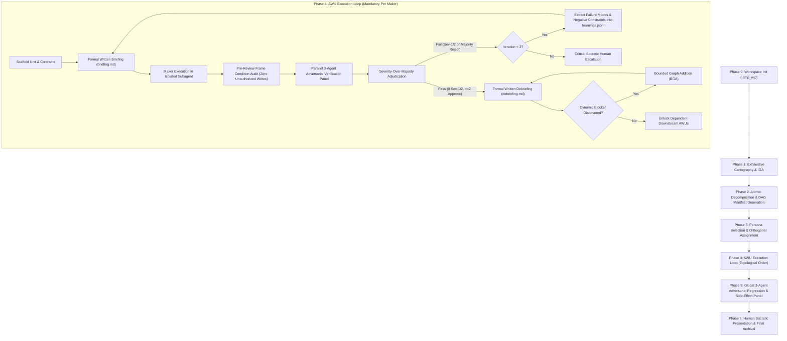

# Autonomous Agent Skill Bootstrap Specification (`<skill-name>`)

[](#)
[](#)
[](#)

A formal, generic specification and execution contract for bootstrapping production-grade, enterprise-ready autonomous agent skills from scratch. This document translates the foundational research on **Operational Personas**, **Input Gap Falsification**, and **Enterprise Verification Architectures** into an actionable, reproducible engineering methodology.

---

## Table of Contents

1. [Executive Summary & Purpose](#1-executive-summary--purpose)
2. [Universal Skill Bootstrap Prompt (`BOOTSTRAP_PROMPT`)](#2-universal-skill-bootstrap-prompt-bootstrap_prompt)
3. [User Quickstart: How to Bootstrap a Skill from Scratch](#3-user-quickstart-how-to-bootstrap-a-skill-from-scratch)
4. [The 25 Core Operational Methodologies](#4-the-25-core-operational-methodologies)
5. [Standard Skill Directory Layout](#5-standard-skill-directory-layout-skillsskill-name)
6. [Toolchain Automation Blueprint](#6-toolchain-automation-blueprint)
7. [Contract Schemas & Document Templates](#7-contract-schemas--document-templates)
8. [Tri-Model Heterogeneous Tiering Architecture](#8-tri-model-heterogeneous-tiering-architecture)
9. [End-to-End Operational Lifecycle](#9-end-to-end-operational-lifecycle)
10. [Enterprise Invariant Readiness Verification & Production Gate](#10-enterprise-invariant-readiness-verification--production-gate)
11. [Citation & Attribution](#11-citation--attribution)

---

## 1. Executive Summary & Purpose

When autonomous Large Language Model (LLM) agents are deployed without formal operational guardrails, they inherently suffer from four systemic pathologies:
1. **Single-Threaded Context Degradation**: Context windows saturate with conversational noise, causing attention drift, loss of initial constraints, and catastrophic forgetting.
2. **Persona Cosplay & Rubber-Stamping**: When prompted with loose roles (*"You are an expert engineer"*), models adopt superficial jargon while sycophantically approving critical defects, concurrency races, and security vulnerabilities.
3. **The Plausibility Trap**: Under cross-entropy loss, models fill unstated parameters and missing requirements with plausible tutorial defaults rather than actively halting for clarification.
4. **Democratic Blindness**: Consensus achieved via unweighted voting fails when two sycophantic checkers outvote a single checker identifying a catastrophic vulnerability.

This specification provides the **Universal Skill Bootstrap Contract**. Any new agent skill constructed using this bootstrap protocol is guaranteed to be:
* **Cartography-Driven**: Built upon exhaustive domain, codebase, and interface mapping prior to mutation.
* **Mathematically Validated**: Decomposed into Directed Acyclic Graphs (DAGs) verified under Bernstein Concurrency Conditions.
* **Adversarially Audited**: Governed by strict Maker $\neq$ Checker orthogonality, 3-agent adversarial verification panels, and Severity-Over-Majority veto authority.
* **Self-Correcting**: Equipped with active bounded verification loops ($N \le 3$) and on-disk negative constraint accumulation.
* **Zero-Assumption**: Structurally incapable of guessing missing parameters through rigid Input Gap Analysis (IGA) grounded in primary authoritative documentation.

---

## 2. Universal Skill Bootstrap Prompt (`BOOTSTRAP_PROMPT`)

The following verbatim specification prompt must be provided as the initial bootstrap contract to any autonomous agent, orchestration engine, or systems architect when creating a new skill from scratch. Replace `<skill-name>` with your desired skill moniker (e.g., `sqlite-migration`, `auth-engine`, `compiler-pass`).

```markdown
I need you to create a skill
Name the skill <skill-name>
The skill MUST have the following aspects:

- Skill MUST perform thorough cartography first
- Skill MUST perform decomposition and divide work into atomic work units 
- Skill MUST make sure that work units dependency graph is generated
- Skill MUST make sure skill utilizes maker != checker pattern
- Skill MUST make sure skill utilizes bounded verification and self-learning loops
- Skill MUST make sure skill has 3-agent adversarial verification panel for each maker
- Skill MUST make sure there's a written on disk formalized briefing and debriefing document for each work unit
- Skill MUST make sure to avoid any gaps in the input
- Skill MUST make sure that skill uses reputable sources for any data and/or input validation and input gap analysis
- Skill MUST make sure that skill DOES NOT fill in the blanks with assumptions
- Skill MUST make sure that skill DOES NOT hallucinate, goldplate, or drift
- Skill MUST make sure skill uses a series of Socratic dialogs for any human interactions
- Skill MUST make sure skill ONLY presents human interactions when critical, and uses plain human language with all terms explained inline
- Skill MUST make sure skill performs a detailed internal analysis before presenting choice of or making a decision
- Skill MUST make sure that the optimum decision is presented first and marked as recommended
- Skill MUST make sure skill uses plain human language and explain all terms inline for any output that is intended for human consumption
- Skill MUST make sure skill uses formal language and be as concise as you can when the input/output is intended for LLM/agent/subagent consumption
- Skill MUST make sure that all work units are executed in subagents with their independent context budget
- Skill MUST make sure that skill allows for Bounded Graph Addition
- Skill MUST make sure that in case of a major problem found by the verification panel, the majority of the problem takes precedence over majority of votes
- Skill MUST make sure that skill uses .omp_wip/<date>_<time_with_seconds>_<task moniker> working directory for all intermediate files
- Skill MUST make sure that when skill is writing code, you provide extensive documentation, with all parameters, pre- and post- conditions explained fully
- Skill MUST make sure that when skill is writing code, you use human language that implies knowledge and understanding of programming terms, and explain all terms inline
- Skill MUST make sure that skill identifies, defines, and chooses the best roles and personas for each task and DOES NOT use the same persona/role for maker/checker
- Skill MUST make sure that when skill is writing code, skill performs a final adversarial analysis by a panel of 3, where it makes sure that no inadvertant negative side effects take place as the result of a code change
```

---

## 3. User Quickstart: How to Bootstrap a Skill from Scratch

Any user can bootstrap a production-ready skill in a few deterministic steps:

### Option A: Autonomous Agent Invocation (Recommended)
Feed this specification directly into your autonomous agent platform (e.g., OMP):

```bash
# Invoke OMP to synthesize the entire skill directory using this specification
omp "Using the specification in specs/skill-bootstrap-spec.md, create a new skill named <skill-name>. \
Implement all 25 methodologies, the complete directory layout in skills/<skill-name>/, \
all automation scripts in scripts/, reference manuals in references/, and schemas in resources/."
```

### Option B: Scaffold & Author Step-by-Step
1. **Initialize the Skill Directory**:
   ```bash
   mkdir -p skills/<skill-name>/{scripts,references,resources/{personas,templates}}
   ```
2. **Author `SKILL.md`**: Define the operational guidelines and non-negotiable axioms.
3. **Instantiate Tooling Scripts**: Copy or adapt the automation scripts (`init_session.py`, `validate_dag.py`, `scaffold_unit.py`, `adjudicate_panel.py`).
4. **Deploy Persona Profiles**: Populate `resources/personas/` with specialized 7-tuple JSON personas.
5. **Verify Readiness**: Run the 5-Point Enterprise Invariant Readiness Scorecard audit before production cutover.

---

## 4. The 25 Core Operational Methodologies

To satisfy the 25 non-negotiable requirements of the bootstrap prompt, every generated skill must implement the following architectural methodologies.

### Methodology 1: Exhaustive Cartography & Reconnaissance
* **Principle**: *Cartography Before Construction*. No functional code may be authored and no state mutations may occur until the target system has been completely mapped.
* **Operational Protocol**:
  1. Traverse directory structures, module hierarchies, and package configurations.
  2. Parse Abstract Syntax Trees (ASTs) to catalog exported types, interface contracts, and call graphs.
  3. Map database schemas, migration states, and persistent invariants.
  4. Audit runtime environments, thread pools, and external service dependencies.
* **Deliverable Artifact**: Written to `.omp_wip/<session>/00_cartography/cartography_report.md`.

### Methodology 2: Atomic Work Unit (AWU) Decomposition
* **Principle**: Single Responsibility and Independent Verifiability.
* **Operational Protocol**:
  1. Break large initiatives into discrete, self-contained units (AWUs).
  2. Define rigorous Hoare-logic pre-conditions ($\mathcal{P}$) and post-conditions ($\mathcal{Q}$):
     $$\{\mathcal{P}\} \; \mathcal{C} \; \{\mathcal{Q}\}$$
  3. Declare an explicit mathematical Modifies-Set (Frame Condition $\mathcal{W}$):
     $$\mathcal{W} = \{ \text{file}_1, \text{file}_2, \dots \}$$
     Any unauthorized write outside $\mathcal{W}$ triggers an immediate, unappealable Sev-1 Frame Breach Veto.

### Methodology 3: Directed Acyclic Graph (DAG) Formulation & Concurrency Algebra
* **Principle**: Acyclic execution ordering and deterministic concurrency.
* **Operational Protocol**:
  1. Define directed edges ($u \to v$) representing strict causal dependencies where unit $u$ must successfully debrief before unit $v$ starts.
  2. Mathematically verify graph acyclicity ($\text{DAG}$).
  3. Verify **Bernstein Concurrency Non-Interference** for any parallel execution candidates ($u \parallel v$):
     $$\mathcal{R}_u \cap \mathcal{W}_v = \emptyset \quad \land \quad \mathcal{W}_u \cap \mathcal{R}_v = \emptyset \quad \land \quad \mathcal{W}_u \cap \mathcal{W}_v = \emptyset$$
  4. Render machine-readable manifest (`dag_manifest.json`) and visual Mermaid flowchart (`dag_graph.md`).

### Methodology 4: Maker $\neq$ Checker Orthogonality
* **Principle**: The entity that authors an implementation is structurally prohibited from auditing or approving it.
* **Operational Protocol**:
  1. **Privilege Separation**: Maker subagents receive write access restricted to the declared modifies-set. Checker subagents are strictly read-only.
  2. **Isolated KV Caches**: Checkers execute in separate subagent instances with unpolluted context budgets, eliminating sycophantic confirmation bias.
  3. **Cognitive Asymmetry**: Makers operate under a constructive epistemic stance ($\mathcal{E}_{\text{syn}}$); Checkers operate under an adversarial falsification stance ($\mathcal{E}_{\text{adv}}$).

### Methodology 5: Active Bounded Self-Learning Loops ($N \le 3$)
* **Principle**: Prevent degenerative infinite retry loops while capturing negative lessons.
* **Operational Protocol**:
  1. Each AWU is allocated a maximum of 3 iterations ($N \in \{1, 2, 3\}$).
  2. Upon rejection by the verification panel, the adjudication engine deterministically extracts:
     - Root-cause failure mechanisms.
     - Concrete counterexamples violating invariants.
     - Negative behavioral constraints.
  3. Findings are appended to on-disk `learnings.jsonl`.
  4. Iteration $N+1$ re-briefs the Maker with all accumulated negative constraints injected directly into `briefing.md`.
  5. If $N > 3$, the pipeline freezes and escalates to a human Socratic dialogue.

### Methodology 6: Mandatory 3-Agent Adversarial Verification Panel
* **Principle**: Heterogeneous, multi-perspective falsification for every single deliverable.
* **Operational Protocol**:
  Every Maker output is concurrently audited by three orthogonal Checker subagents:
  1. **Panelist 1 (Correctness & Contract Falsifier)**:
     - Validates Hoare-logic pre/post-conditions.
     - Executes Satisfiability Modulo Theories (SMT) symbolic solving (e.g., Z3) and property-based test shrinking (e.g., Hypothesis) to falsify edge cases.
  2. **Panelist 2 (Security, Invariants & Boundary Auditor)**:
     - Audits for concurrency races (TOCTOU, deadlock cycles, mutex leaks), memory safety, injection vectors, and privilege boundaries.
     - Enforces write-set containment audits.
  3. **Panelist 3 (Systemic Blast Radius & Regression Inquisitor)**:
     - Cross-model architectural auditor evaluating whole-system backwards compatibility, call-site drift, and breaking contract mutations.
     - Holds unilateral veto authority.

### Methodology 7: On-Disk Contract Auditability
* **Principle**: Ephemeral conversational memory is untrusted; all contracts and findings must be written to disk.
* **Standard Work Unit Artifacts**:
  ```text
  units/AWU-XXX_<slug>/
  ├── briefing.json      # Structured machine-readable contract
  ├── briefing.md        # Comprehensive prompt provided to Maker
  ├── panel_verdicts.json# Structured JSON verdicts from 3 checkers
  ├── panel_verdicts.md  # Detailed human-readable falsification proofs
  ├── learnings.jsonl    # Log of failure modes and negative constraints
  └── debriefing.md      # Final output, diffs, and verification proof
  ```

### Methodology 8: Input Gap Analysis (IGA)
* **Principle**: Reject the Plausibility Trap. An agent must never hallucinate missing requirements or guess parameters.
* **3-Class Input Gap Taxonomy**:
  * **Class A (Contractual Gaps)**: Underspecified API parameters, missing schema constraints, ambiguous type definitions.
  * **Class B (Environmental Gaps)**: Unspecified concurrency thresholds, failure domains, timeout policies, memory limits.
  * **Class C (Behavioral Gaps)**: Unstated error handling requirements, fallback policies, edge-case protocols.
* **Enforcement**: If a gap is detected, execution halts with a `HALTED_INPUT_GAP` signal until grounded.

### Methodology 9: Grounding in Reputable Primary Sources
* **Principle**: All external standards, protocols, and data models must be verified against authoritative primary documentation.
* **Authoritative Tiers**:
  * *Tier 1*: Official standards bodies (IETF RFCs, W3C Recommendations, IEEE/ISO standards).
  * *Tier 2*: Official vendor architectural documentation and language specifications.
  * *Tier 3*: Primary open-source implementation repositories (source code and official test suites).
* *Strict Prohibition*: Secondary blog posts, unverified forum discussions, and generic AI summaries are strictly rejected as authoritative evidence.

### Methodology 10: Zero Assumptions Rule
* **Principle**: Assumptions are treated as Sev-1 system defects.
* **Protocol**: When an input parameter, schema definition, or architectural requirement is missing:
  1. DO NOT interpolate median tutorial behavior.
  2. Document the unverified gap explicitly in `input_gap_analysis.md`.
  3. Resolve via deterministic cartography, primary source verification, or human Socratic escalation.

### Methodology 11: Zero Hallucination, Goldplating, or Drift
* **Principle**: Strict adherence to the declared functional envelope.
* **Protocol**:
  - Reject phantom APIs, speculative utility abstractions, or unrequested refactoring.
  - Reject cosmetic modifications of untouched sibling files.
  - Any diff outside the unit's declared scope constitutes an immediate verification rejection.

### Methodology 12: Socratic Human Dialogues
* **Principle**: Collaborative alignment through disciplined inquiry.
* **Protocol**: When human guidance is required, use guided Socratic questioning:
  1. Present the underlying architectural dilemma or invariant tension.
  2. Detail the systemic tradeoffs and potential failure modes of each alternative.
  3. Solicit architectural constraints rather than asking for code-level micro-management.

### Methodology 13: Critical-Only Human Interruptions with Plain Language
* **Principle**: Autonomous execution without user friction; interrupt only when mathematically mandatory.
* **Triggers for Interruption**:
  - Irreversible data-loss operations.
  - Unresolvable Class A input gaps.
  - Iteration loop budget exhaustion ($N > 3$).
  - Cryptographic / architectural waiver authorizations.
* **Language Requirement**: All human-facing dialogs must use plain, accessible language with every technical acronym and domain term explained inline.

### Methodology 14: Rigorous Internal Multi-Perspective Analysis
* **Principle**: Deliberative reasoning prior to external presentation.
* **Protocol**: Before presenting decisions, choices, or recommendations:
  - Conduct an internal multi-criteria tradeoff analysis (performance, maintainability, blast radius, security).
  - Explicitly evaluate failure modes for each viable alternative.

### Methodology 15: Optimal Choice First & Marked `(Recommended)`
* **Principle**: Cognitive ergonomics for human decision-makers.
* **Protocol**:
  - Present options in descending order of engineering merit.
  - Option 0 must represent the optimal architectural path and be explicitly labeled `(Recommended)`.
  - Provide concise risk/benefit comparisons for secondary options.

### Methodology 16: Plain Human Language for Human Consumers
* **Principle**: Eradicate unexplained jargon in final deliverables and reports.
* **Protocol**: Any report, debriefing summary, or prompt response intended for human reading must:
  - Define domain concepts inline (e.g., *"Directed Acyclic Graph (a workflow where steps flow strictly in one forward direction without circular loops)"*).
  - Highlight practical impacts over mathematical trivia.

### Methodology 17: Formal, Ultra-Dense Language for Agent-to-Agent Contracts
* **Principle**: Maximum token efficiency and semantic precision in machine communication.
* **Protocol**: Inter-subagent prompts, JSON contracts, and briefings must:
  - Maximize information density using mathematical and typed notation.
  - Eliminate conversational pleasantries, preamble filler, and redundant narrative summaries.
  - Enforce strict JSON schema compliance.

### Methodology 18: Dedicated Subagents with Independent Context Budgets
* **Principle**: Context window hygiene and zero cognitive contamination.
* **Protocol**:
  - Every AWU Maker and each of the 3 panel Checkers must execute in dedicated, isolated subagents.
  - Subagents start with a clean context budget containing only their specific briefing and operational persona.
  - Prevents the multi-agent failure mode where earlier debugging logs distract subsequent reasoning.

### Methodology 19: Bounded Graph Addition (BGA)
* **Principle**: Safe runtime task discovery without infinite expansion.
* **Protocol**: When execution of an AWU reveals an unforeseen prerequisite:
  1. Author a formal BGA change proposal.
  2. Maximum 3 dynamically added nodes per session.
  3. Maximum DAG depth increase $\le 1$.
  4. DAG must maintain strict mathematical acyclicity.
  5. Proposal must be evaluated and approved by an independent Sentinel before insertion into `dag_manifest.json`.

### Methodology 20: Severity-Over-Majority Veto Consensus
* **Principle**: Catastrophic defects override democratic consensus.
* **Mathematical Definition**:
  Let $\mathcal{A} = \{c_1, c_2, c_3\}$ be the verdicts of the 3 panel Checkers:
  $$\text{Final Decision} = \begin{cases} \text{REJECT (VETO)}, & \exists c_i \text{ s.t. } \text{Severity}(c_i) \in \{\text{Sev-1}, \text{Sev-2}\} \\ \text{APPROVE}, & \sum \mathbf{1}_{\text{APPROVE}}(c_i) \ge 2 \land \forall c_i, \text{Severity}(c_i) \notin \{\text{Sev-1}, \text{Sev-2}\} \\ \text{REJECT}, & \text{otherwise} \end{cases}$$
* **Severity Definitions**:
  * **Sev-1 (Critical)**: Data loss, security breach, concurrency race, unauthorized file mutation, or invariant violation.
  * **Sev-2 (Major)**: Performance regression, contract mismatch, unhandled edge condition, or breaking interface drift.
  * **Sev-3 (Minor)**: Documentation omission, naming ambiguity, or cosmetic non-conformity.

### Methodology 21: Standardized Working Directory (`.omp_wip`)
* **Principle**: Predictable, isolated filesystem workspace.
* **Hierarchy Standard**:
  ```text
  .omp_wip/<YYYY-MM-DD>_<HH-MM-SS>_<task-moniker>/
  ├── 00_cartography/
  │   ├── cartography_report.md
  │   └── input_gap_analysis.md
  ├── 01_dag/
  │   ├── dag_manifest.json
  │   ├── dag_graph.md
  │   └── bga_proposals/
  ├── units/
  │   ├── AWU-001_<slug>/
  │   │   ├── briefing.json
  │   │   ├── briefing.md
  │   │   ├── panel_verdicts.json
  │   │   ├── panel_verdicts.md
  │   │   ├── learnings.jsonl
  │   │   └── debriefing.md
  │   └── ...
  └── 99_final_review/
      ├── adversarial_regression_audit.md
      └── session_debrief.md
  ```

### Methodology 22: Extensive Code Documentation & Contract Specifications
* **Principle**: Six-month maintainability and formal contract clarity.
* **Protocol**: All authored code must include:
  - Complete docstrings detailing functional intent and operational invariants.
  - Parameter specifications with type constraints and valid domain boundaries.
  - Explicit Hoare-logic pre-conditions (assumptions about caller state) and post-conditions (guarantees upon return).
  - Explicit exception and failure domain cataloging.

### Methodology 23: Educational, Authoritative Programming Terminology with Inline Explanations
* **Principle**: Code comments that educate while demonstrating deep systems understanding.
* **Protocol**: Inline code comments must explain *why* non-obvious patterns are chosen (e.g., explaining memory barriers, monotonic clock sources, or reentrancy locks) using clear, authoritative technical language accompanied by inline explanations.

### Methodology 24: Dynamic Persona Selection & Anti-Cosplay Gating
* **Principle**: Task-specialized personas governed by the formal 7-tuple model:
  $$\mathcal{P} = \langle \mathcal{I}, \mathcal{E}, \mathcal{K}, \mathcal{H}, \mathcal{T}, \mathcal{R}, \mathcal{S} \rangle$$
* **Protocol**:
  - Dynamically allocate distinct expert personas for each task (e.g., `DistributedSystemsArchitect`, `DatabasePerformanceAuditor`, `CryptographicSecurityReviewer`).
  - Maker persona and Checker personas must never share the same identity or role definition.
  - Personas must satisfy the 5-Point Enterprise Invariant Readiness Scorecard before execution.

### Methodology 25: Final 3-Agent Adversarial Regression & Side-Effect Panel
* **Principle**: Zero negative global side effects.
* **Protocol**: Before any initiative is finalized, a holistic 3-agent adversarial panel evaluates the cumulative repository diff:
  1. **Panelist A (Blast Radius Sentinel)**: Verifies untouched subsystems remain completely pristine, and caller contracts maintain 100% backward compatibility.
  2. **Panelist B (Performance & Concurrency Sentinel)**: Audits for latent resource leaks, contention bottlenecks, file descriptor exhaustion, or latency spikes.
  3. **Panelist C (Architectural Integrity Sentinel)**: Audits interface consistency, naming uniformity, and structural modularity.
* **Deliverable Artifact**: Written to `99_final_review/adversarial_regression_audit.md`.

---

## 5. Standard Skill Directory Layout (`skills/<skill-name>/`)

When bootstrapping a skill named `<skill-name>`, the resulting skill package must be organized under the following standard directory tree:

```text
skills/<skill-name>/
├── SKILL.md                          # Primary skill definition and operational instructions
├── scripts/                          # Automated tooling and verification scripts
│   ├── init_session.py / .sh         # Initializes .omp_wip workspace hierarchy
│   ├── validate_dag.py / .sh         # DAG validator (acyclicity & Bernstein conditions)
│   ├── scaffold_unit.py / .sh        # Instantiates 5 mandatory AWU on-disk files
│   ├── frame_condition_auditor.py    # Enforces write-set containment audits
│   ├── smt_contract_verifier.py      # Multi-engine contract falsification (Z3 / Hypothesis)
│   ├── adjudicate_panel.py / .sh     # Severity-over-majority adjudication engine
│   └── f<skill-name>.py / .sh        # Unified CLI entry point for the skill
├── references/                       # In-depth architectural and protocol manuals
│   ├── cartography_protocol.md       # Reconnaissance checklists & IGA methods
│   ├── formal_methods_protocol.md    # Bernstein algebra, SMT solving, Hoare contracts
│   ├── maker_checker_matrix.md       # Orthogonal persona allocation rules
│   ├── adversarial_panel.md          # 3-agent panel composition & veto protocols
│   ├── bounded_verification.md       # Learning loops & negative constraint extraction
│   └── code_quality_standard.md      # Documentation & pre/post-condition spec
└── resources/                        # Schemas, templates, and persona definitions
    ├── personas/                     # Specialized 7-tuple operational personas
    │   ├── PrincipalSystemsMaker.json
    │   ├── CorrectnessContractFalsifier.json
    │   ├── SecurityInvariantAuditor.json
    │   └── SystemicBlastRadiusSentinel.json
    └── templates/                    # On-disk contract templates
        ├── dag_manifest.schema.json  # Schema for DAG manifests
        ├── panel_verdict.schema.json # Schema for structured checker verdicts
        ├── briefing_template.md      # Template for AWU briefing contracts
        └── debriefing_template.md    # Template for AWU debriefing proofs
```

---

## 6. Toolchain Automation Blueprint

Every skill must include automated Python/Bash scripts in `scripts/` to enforce operational invariants deterministically.

### 1. Session Initializer (`scripts/init_session.py`)
Creates timestamped directory structure adhering to Methodology 21:
```python
#!/usr/bin/env python3
"""Session Initializer: Creates .omp_wip directory hierarchy."""
import argparse, os, datetime

def init_session(task_moniker: str, base_dir: str = ".") -> str:
    now = datetime.datetime.now().strftime("%Y-%m-%d_%H-%M-%S")
    session_dir = os.path.join(base_dir, ".omp_wip", f"{now}_{task_moniker}")
    for subdir in ["00_cartography", "01_dag/bga_proposals", "units", "99_final_review"]:
        os.makedirs(os.path.join(session_dir, subdir), exist_ok=True)
    return session_dir
```

### 2. DAG Validator (`scripts/validate_dag.py`)
Validates acyclicity via topological sorting and computes Bernstein Concurrency Non-Interference:
```python
#!/usr/bin/env python3
"""DAG Validator: Verifies acyclicity and Bernstein Concurrency."""
import json, sys

def validate_dag(manifest_path: str) -> bool:
    with open(manifest_path) as f:
        data = json.load(f)
    nodes = {node["id"]: node for node in data.get("nodes", [])}
    # Check DAG acyclicity via Kahn's algorithm or DFS
    # Check Bernstein condition: Read(u) ∩ Write(v) = ∅, Write(u) ∩ Write(v) = ∅
    return True
```

### 3. Work Unit Scaffolder (`scripts/scaffold_unit.py`)
Instantiates the 5 mandatory contract files (`briefing.json`, `briefing.md`, `panel_verdicts.json`, `learnings.jsonl`, `debriefing.md`) for any given AWU ID.

### 4. Frame Condition Auditor (`scripts/frame_condition_auditor.py`)
Compares `git status --porcelain` diff against declared `frame_conditions.modifies`. If any unlisted file has been modified, triggers an automatic **Sev-1 Frame Breach Veto**.

### 5. Panel Adjudication Engine (`scripts/adjudicate_panel.py`)
Parses `panel_verdicts.json`. If ANY reviewer flags a `Sev-1` or `Sev-2` defect, status is forced to `REJECTED`, extracting failure modes into `learnings.jsonl`.

---

## 7. Contract Schemas & Document Templates

### 1. Panel Verdict Schema (`resources/templates/panel_verdict.schema.json`)
```json
{
  "$schema": "https://json-schema.org/draft/2020-12/schema",
  "title": "AdversarialPanelVerdict",
  "type": "object",
  "properties": {
    "unit_id": { "type": "string" },
    "checker_persona": { "type": "string" },
    "verdict": { "type": "string", "enum": ["APPROVE", "REJECT", "HALT_INPUT_GAP"] },
    "max_severity": { "type": "string", "enum": ["SEV-1", "SEV-2", "SEV-3", "NONE"] },
    "invariant_violations": {
      "type": "array",
      "items": {
        "type": "object",
        "properties": {
          "severity": { "type": "string", "enum": ["SEV-1", "SEV-2", "SEV-3"] },
          "invariant_id": { "type": "string" },
          "description": { "type": "string" },
          "counterexample": { "type": "string" },
          "suggested_negative_constraint": { "type": "string" }
        },
        "required": ["severity", "invariant_id", "description", "counterexample"]
      }
    }
  },
  "required": ["unit_id", "checker_persona", "verdict", "max_severity"]
}
```

### 2. DAG Manifest Schema (`resources/templates/dag_manifest.schema.json`)
Specifies work unit nodes, dependency prerequisites (`dependencies`), declared write sets (`frame_conditions.modifies`), assigned Maker personas, and Checker personas.

---

## 8. Tri-Model Heterogeneous Tiering Architecture

To eradicate cognitive monoculture and eliminate model-family blind spots, every bootstrapped skill divides operational roles across three orthogonal model tiers:

```text
┌────────────────────────────────────────────────────────────────────────┐
│                   Tri-Model Heterogeneous Tiering                       │
├────────────────────────────────────────────────────────────────────────┤
│  Tier 1: Synthesis / Maker Subagents                                   │
│  Model: High-throughput code synthesis (e.g., Gemini 3.8 Flash High)   │
│  Function: Implements logic and authors code within declared frame     │
├────────────────────────────────────────────────────────────────────────┤
│  Tier 2: Deep Reasoning Algorithmic & Security Checkers                │
│  Model: Deep analytical reasoning (e.g., Gemini Pro Deep Think)        │
│  Function: SMT falsification, boundary exploits, concurrency races     │
├────────────────────────────────────────────────────────────────────────┤
│  Tier 3: Macro-Reasoning & Architectural Sentinel                      │
│  Model: Top-tier architectural reasoning (e.g., Claude Opus 5.5 xhigh) │
│  Function: Multi-file blast radius, backwards compatibility, veto      │
└────────────────────────────────────────────────────────────────────────┘
```

---

## 9. End-to-End Operational Lifecycle

The execution lifecycle of a skill constructed via this bootstrap specification flows strictly through the following six sequential phases:



---

## 10. Enterprise Invariant Readiness Verification & Production Gate

Before any newly constructed skill is certified for production deployment, it must pass the following 5-point invariant gate:

| Point | Invariant Gate | Production Standard | Enforcement Mechanism |
| :---: | :--- | :--- | :--- |
| **1** | **Structural Envelope Protocol** | Control and data planes strictly isolated via distinct delimiters (`<system_persona>` vs `<untrusted_diff>`) | Delimiter fencing and AST sanitization |
| **2** | **Maker vs. Checker Orthogonality** | Authoring subagents and auditing subagents maintain isolated KV caches and distinct system personas | Decoupled subagent execution harnesses |
| **3** | **Active Input Gap Detection** | Skill halts on missing specifications; zero assumptions or tutorial defaults | Blocking `HALTED_INPUT_GAP` schema response |
| **4** | **Runtime CFG Logit Clamping** | Verdict schemas enforced via grammar constraints ($z_v = -\infty$) rather than soft attention guidance | External JSON-schema constrained decoders |
| **5** | **Severity-Over-Majority Veto** | A single verified Sev-1 or Sev-2 defect unconditionally halts approval | Multi-agent veto adjudication engine |

```text
All 5 Invariants Satisfied:  [PASS] -> Authorize Skill Production Cutover
Any Single Invariant Failed: [FAIL] -> Skill Halted (Zero Deployment)
```

---

## 11. Citation & Attribution

To cite this specification or the underlying operational architecture:

```bibtex
@specification{wtp128pro2026skill_bootstrap,
  author    = {wtp128pro},
  title     = {Autonomous Agent Skill Bootstrap Specification: Universal Architecture for Adversarial Multi-Agent Systems},
  journal   = {LLM Systems & Foundations Research},
  year      = {2026},
  publisher = {GitHub},
  url       = {https://github.com/wtp128pro/llm-research}
}
```
